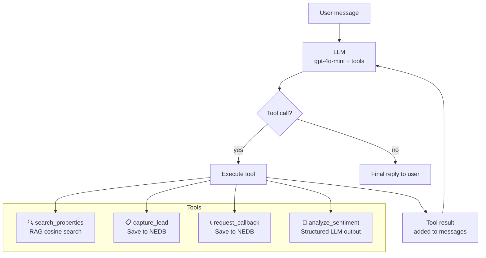
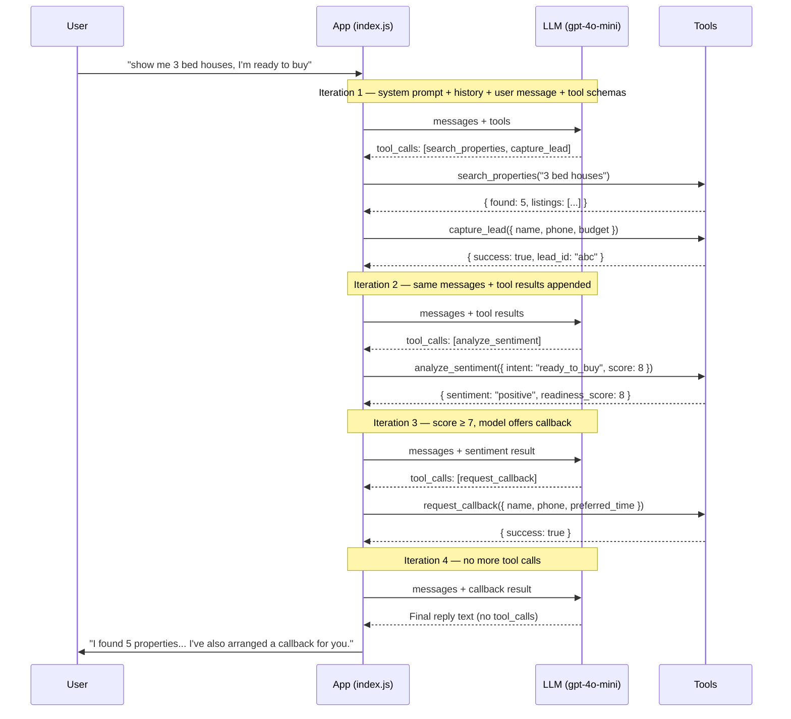

# Day 3 — AI Agents: Property Lead Capture

In Day 2 we built a chatbot that retrieves real listings before answering. It was grounded — but passive. It only ever responded to what you asked.

This session gives the model agency. It decides what to do next.

You chat with a property agent that searches listings, captures your contact details, arranges callbacks, and scores the conversation — all by choosing which tools to call and in what order, without being told.

---

## Chatbot vs Agent

This is the most important concept in Day 3.

| | Chatbot (Day 2) | Agent (Day 3) |
|---|---|---|
| Flow | User asks → LLM replies | User asks → LLM decides → calls tools → replies |
| Tools | None | search, capture lead, callback, sentiment |
| Side effects | None | Writes to a database |
| State | In-memory only | Persisted to disk via NEDB |
| Token cost | 1 API call per turn | Multiple calls per turn (one per loop iteration) |

A chatbot generates text. An agent takes actions.

---

## What You'll Learn

- **Tool use / function calling** — define tools as JSON schemas, let the LLM decide when to call them
- **Agent loop** — model → tool call → result → model → repeat until done
- **Tool chaining** — the model calls search, then capture lead, then sentiment in a single turn
- **Structured output via tool schemas** — sentiment analysis forces the LLM to output typed JSON
- **System prompt as workflow** — the agent's behaviour is driven by the prompt, not hard-coded logic
- **NEDB persistence** — leads and callbacks saved to disk, survive restarts

---

## How It Works



The loop keeps running until the model returns a response with no tool calls. In a single user turn, the agent might call all four tools before giving a final reply.

---

## How to Run

### 1. Install

```bash
cd day-3
npm install
```

### 2. API key

```bash
cp .env.example .env
# add your OpenAI key inside .env
```

### 3. Build the knowledge base

```bash
npm run prepare-data -- --suburb toongabbie-nsw-2146
```

Same pipeline as Day 2 — scrape Domain.com.au, embed listings, cache to disk. The agent uses these embeddings for property search.

### 4. Start the agent

```bash
npm start
```

### 5. Chat naturally

The agent watches for buying signals and acts autonomously:

```
You: show me 3 bed houses under $800k
You: I love that one on Dunmore Street — what else is nearby?
You: I'm planning to buy in the next couple of months
You: Sure, my name is John Smith — 0412 345 678
```

Behind the scenes it will search listings, capture your lead, score the conversation, and offer a callback — without you asking for any of it.

**Commands:**

| Command | What it shows |
|---|---|
| `show leads` | All captured leads with sentiment scores and buying intent |
| `show callbacks` | All callback requests with preferred times |
| `quit` | Exit |

---

## Key Concepts

### Tool Use / Function Calling

Tools are defined as JSON schemas and sent to the model on every API call. The model reads the `description` to decide when a tool is relevant, and reads the `parameters` to know what arguments to provide.

```js
{
  name: 'capture_lead',
  description: 'Save the user\'s contact details. Call once you have name + contact method.',
  parameters: {
    name:   { type: 'string' },
    email:  { type: 'string' },
    phone:  { type: 'string' },
    budget: { type: 'string' },
  }
}
```

The description is the interface — the model never sees your implementation code. A vague description means the tool gets called at the wrong time or not at all.

### The Agent Loop



Token cost accumulates across iterations. Each iteration is a separate API call that sends the full growing messages array — system prompt + history + all prior tool results. A turn with 3 tool calls makes 4 API calls total. This is why agent costs are higher per turn than a plain chatbot, and why picking a cheaper model like `gpt-4o-mini` matters for loops.

### The Four Tools

**`search_properties`** — wraps the Day 2 RAG pipeline. Embeds the query, cosine searches the vector store, returns the top 5 listings. The model calls this for any property question before answering, so it never invents listings.

**`capture_lead`** — saves name, email, phone, suburb interest, and budget to NEDB. The model calls this once it has collected enough details from the conversation naturally — it asks for them rather than demanding them upfront.

**`request_callback`** — saves a callback request. The model calls this either when the user asks for one, or automatically when the sentiment readiness score reaches 7 or higher.

**`analyze_sentiment`** — called immediately after every lead capture. The model fills in the parameters itself based on its reading of the full conversation:

```js
sentiment:       'positive' | 'neutral' | 'negative'
intent:          'browsing' | 'interested' | 'ready_to_buy'
readiness_score: 1–10
key_interests:   ['pool', 'good schools', 'under $900k']
summary:         'Looking to buy within 2 months, family home preferred'
```

This is structured output via tool schema — the model produces typed JSON by being required to fill in typed parameters. No second API call, no parsing step.

### System Prompt as Workflow

The agent's behaviour is defined entirely in the system prompt — not in application code. The prompt tells the model:

- Search before answering any property question
- Ask for contact details when the user shows genuine intent
- Always call `analyze_sentiment` after capturing a lead
- Offer a callback when readiness score ≥ 7

You can change the agent's behaviour by editing the prompt. The loop code stays the same.

### NEDB

NEDB is an embedded NoSQL database — no server, no Docker. Data persists in two files:

```
data/leads.db
data/callbacks.db
```

The API mirrors MongoDB. Every lead survives a restart. Run `show leads` to see all captured leads with their full sentiment analysis.

---

## What Gets Stored

Every captured lead includes contact details and the sentiment analysis attached to it:

```json
{
  "name": "John Smith",
  "email": "john@example.com",
  "phone": "0412 345 678",
  "suburb_interest": "Toongabbie",
  "budget": "$700k–$850k",
  "sentiment": "positive",
  "intent": "ready_to_buy",
  "readiness_score": 8,
  "key_interests": ["3 bedrooms", "quiet street", "under $850k"],
  "sentiment_summary": "Actively looking to buy within 2 months, strong interest in family homes",
  "createdAt": "2026-04-03T10:30:00.000Z"
}
```

Callback requests are stored separately and linked to the lead:

```json
{
  "name": "John Smith",
  "phone": "0412 345 678",
  "preferred_time": "Tuesday afternoon",
  "lead_id": "abc123",
  "createdAt": "2026-04-03T10:30:05.000Z"
}
```

---

## Try These Conversations

**Property search only:**
```
You: show me 3 bed houses under $800k in Toongabbie
```
Watch `search_properties` fire and the model answer from real listings only.

**Trigger lead capture:**
```
You: I'm planning to buy in the next couple of months, budget around $750k
You: My name is Sarah — sarah@email.com, 0400 111 222
```
Watch `capture_lead` → `analyze_sentiment` → optional `request_callback` fire in sequence.

**Trigger a callback directly:**
```
You: Can I speak to someone about arranging an inspection?
```

**Review what was saved:**
```
show leads
show callbacks
```

---

> A chatbot responds. An agent acts.
>
> The difference is tools — and the loop that keeps running until the job is done.
>
> **Tool schemas** define what the agent can do. **Descriptions** tell it when to act. **The system prompt** defines how it should behave. The loop handles the rest.

**Previous:** [Day 2 — RAG & Embeddings](../day-2/README.md)
