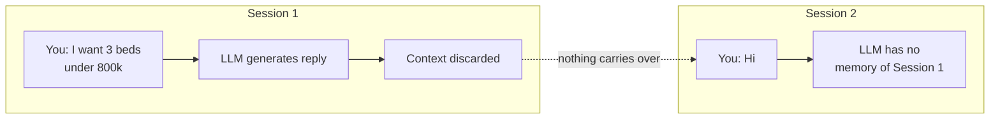
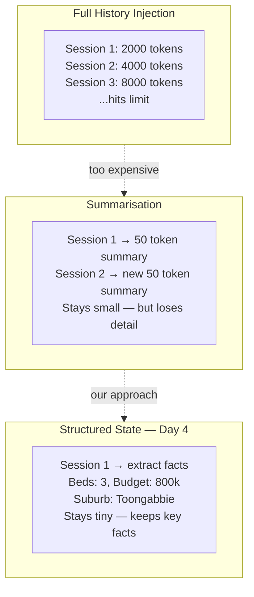
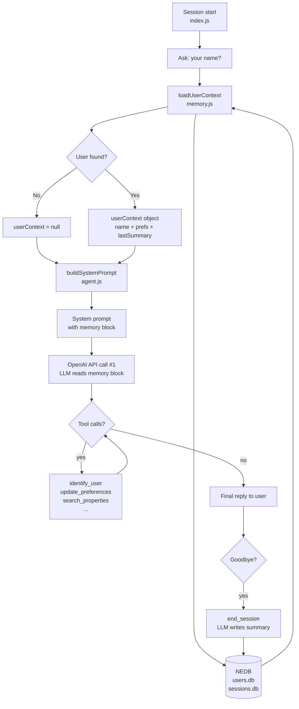
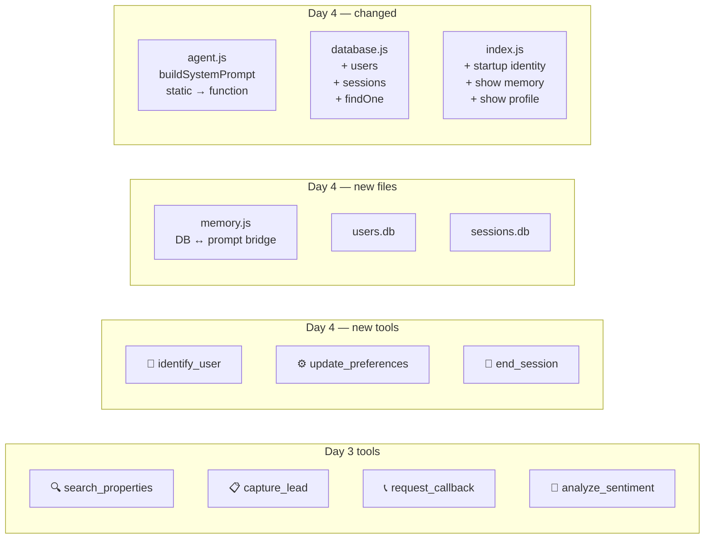
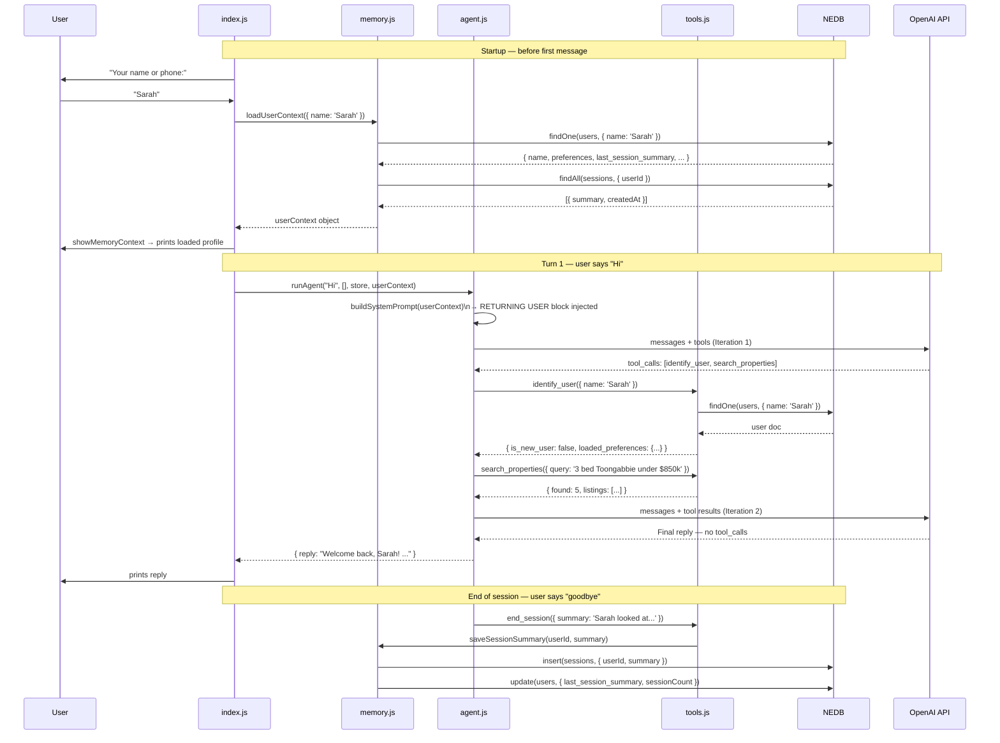
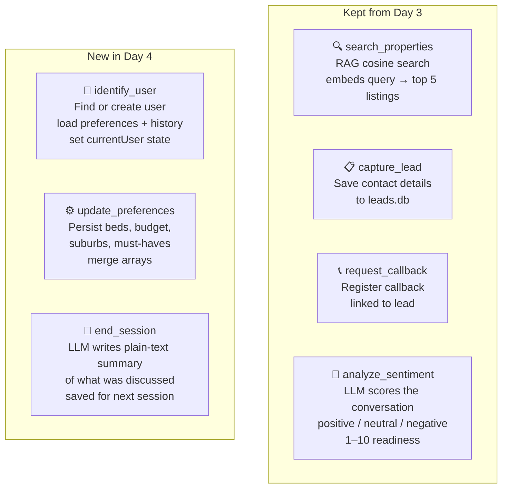
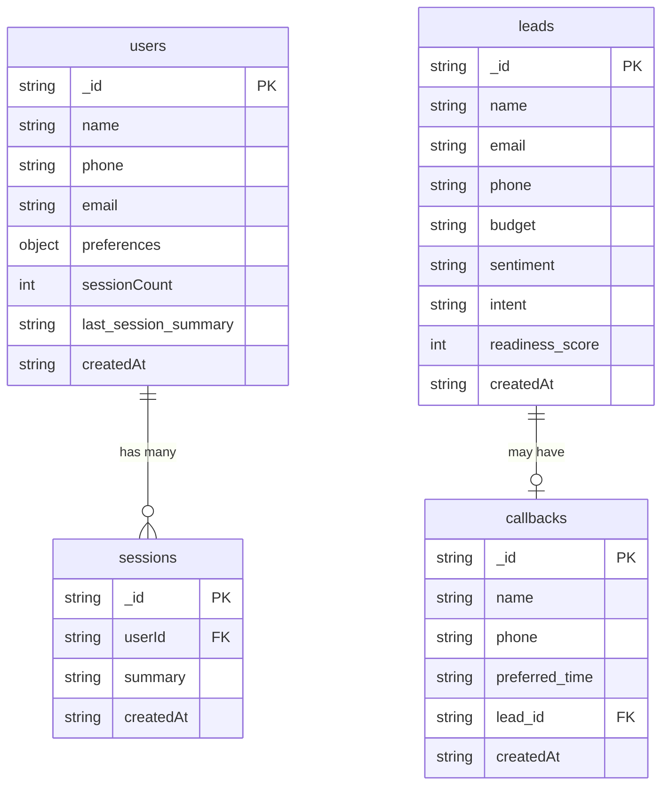
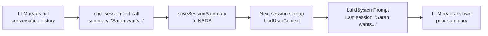
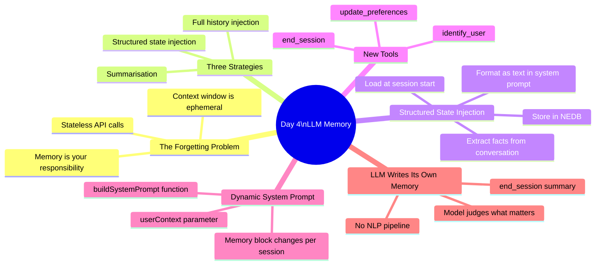

# Day 4 — LLM Memory: Persistent User Profiles

In Day 3 we built an agent that searched properties, captured leads, and analysed sentiment — all autonomously. But every session started from scratch. The agent didn't know you.

Day 4 fixes that. By the end you'll have an agent that greets you by name, remembers your budget, and opens Session 2 with listings it already knows you want — without asking again.

The concept is called **structured state injection**. It is the production-grade approach to giving LLMs memory, and it does not require fine-tuning, vector search, or a special model.

---

## The Forgetting Problem

Before building the solution, understand the constraint.

Every call to the OpenAI API is stateless. The model reads the `messages` array you send, generates a reply, and discards everything. The next call starts with a blank slate. It does not matter that you spoke to it yesterday — it has no record of that.



This is not a bug. Transformer models are stateless by design. The context window is a whiteboard: it exists for one request, then it is wiped. **Memory is entirely your responsibility.**

---

## Three Memory Strategies

There are three common ways to give an LLM memory across sessions:

| Strategy | Mechanism | Scales? | Best for |
|---|---|---|---|
| **Full history injection** | Keep every message; send them all on the next session | No — hits token limits fast | Short transcripts |
| **Summarisation** | Compress old turns into a paragraph; inject that | Yes — but loses detail | Long sessions |
| **Structured state** ✅ | Extract key facts → store in DB → inject at session start | Yes — facts are tiny | User profiles, preferences |



Day 4 uses structured state. Each session extracts facts (beds, budget, suburb, timeline) and stores them in NEDB. The next session loads those facts and injects them into the system prompt as plain text.

---

## Architecture



The flow has two layers:

1. **Startup layer** (`index.js` + `memory.js`): load user from NEDB → build system prompt
2. **Agent layer** (`agent.js` + `tools.js`): normal agent loop — the LLM also calls `identify_user` to set up tool state, `update_preferences` as it learns new things, and `end_session` before goodbye

---

## What's New in Day 4



---

## Session 1 vs Session 2 — Side by Side

This is the tutorial's payoff. Two identical `npm start` runs. One line changes: the name at the prompt.

### Session 1 — new user

```
  ── Memory ──────────────────────────────────────────────────
  No user profile found. Starting fresh.
  Agent will ask for your name and start building your profile.

You: Hi, I'm Sarah and I'm looking for a house in Toongabbie
Agent: Hi Sarah! Great to meet you. What kind of property are you
       looking for, and do you have a budget in mind?
```

System prompt the LLM receives:
```
NEW USER: You have not met this person before.
Ask for their name early in the conversation — call identify_user as soon as you have it.
```

### Session 2 — returning user

```
  Your name or phone: Sarah

  ── Memory: Returning User Loaded ───────────────────────────
  Name:     Sarah
  Sessions: 1
  Beds:     3+
  Budget:   $750k-$850k
  Suburbs:  Toongabbie
  Last:     "Sarah looked at 3-bed houses in Toongabbie under $850k.
             Strong interest in Dunmore Street properties."

  → Agent will greet Sarah by name and open with relevant listings.

You: Hi
Agent: Welcome back, Sarah! Last time we were looking at 3-bedroom homes
       in Toongabbie around $750k-$850k. Want me to pull up today's
       listings for you?
```

System prompt the LLM receives:
```
RETURNING USER:
Name: Sarah
Previous sessions: 1
Known preferences:
  Beds: 3+
  Budget: $750k-$850k
  Suburbs: Toongabbie
Last session summary: Sarah looked at 3-bed houses in Toongabbie under $850k.
                      Strong interest in Dunmore Street properties.
```

The warm greeting in Session 2 is not magic. The LLM read that text and responded to it. No fine-tuning. No special model. Just a string that was pre-populated from NEDB before the first API call.

---

## Code Walkthrough

### 1. `src/database.js` — Collections

Day 4 adds two new NEDB collections to Day 3's `leads` and `callbacks`:

```js
// New in Day 4
export const users = new Datastore({
  filename: join(DATA_DIR, 'users.db'),
  autoload: true,
});

export const sessions = new Datastore({
  filename: join(DATA_DIR, 'sessions.db'),
  autoload: true,
});

// New helper — used by loadUserContext for user lookups
export function findOne(collection, query) {
  return new Promise((resolve, reject) => {
    collection.findOne(query, (err, doc) => {
      if (err) { reject(err); } else { resolve(doc); }
    });
  });
}
```

NEDB stores each collection as a plain `.db` file on disk. No server, no Docker. The data survives restarts.

---

### 2. `src/memory.js` — The DB ↔ Prompt Bridge

This file has one job: turn a database record into a JavaScript object that `buildSystemPrompt` can read.

```js
export async function loadUserContext({ name, phone, email }) {
  // Try phone first (most unique), then email, then name
  let user = null;
  if (phone) { user = await findOne(users, { phone }); }
  if (!user && email) { user = await findOne(users, { email }); }
  if (!user && name)  { user = await findOne(users, { name }); }

  if (!user) { return null; } // First visit — no record exists

  const userSessions = await findAll(sessions, { userId: user._id });

  return {
    userId:       user._id,
    name:         user.name,
    sessionCount: user.sessionCount ?? 0,
    preferences:  user.preferences ?? {},
    lastSummary:  user.last_session_summary ?? null,
    sessions:     userSessions,
  };
}
```

`loadUserContext` returns `null` for new users and a structured object for returning users. That object is passed straight into `buildSystemPrompt`.

---

### 3. `src/agent.js` — Static Prompt → Dynamic Prompt

The biggest change from Day 3. In Day 3, `SYSTEM_PROMPT` was a constant string. In Day 4, it is a function:

```js
// Day 3
const SYSTEM_PROMPT = `You are a smart property agent...`;

// Day 4
function buildSystemPrompt(userContext) {
  const memoryBlock = userContext
    ? `RETURNING USER:
Name: ${userContext.name}
Known preferences:
${formatPreferences(userContext.preferences)}
Last session summary: ${userContext.lastSummary ?? 'none recorded'}`
    : `NEW USER: Ask for their name early in the conversation.`;

  return `You are a smart property agent assistant...

${memoryBlock}

MEMORY WORKFLOW:
1. Call identify_user early every session
2. Call update_preferences when user mentions beds, budget, suburbs, or timeline
3. Call end_session before saying goodbye`;
}
```

The function is called once per agent turn:

```js
export async function runAgent(userMessage, history, store, userContext = null) {
  const messages = [
    { role: 'system', content: buildSystemPrompt(userContext) }, // ← memory injected here
    ...history,
    { role: 'user', content: userMessage },
  ];
  // ... agent loop (identical to Day 3)
}
```

---

### 4. `src/tools.js` — Three New Tools

Day 4 adds three memory tools on top of Day 3's four. They all share a module-level `currentUser` variable — the same pattern as `lastLeadId` in Day 3.

```js
let lastLeadId  = null; // Day 3 — links capture_lead → analyze_sentiment
let currentUser = null; // Day 4 — links identify_user → update_preferences → end_session
```

**`identify_user`** — find or create the user, set `currentUser`:

```js
export async function identify_user({ name, phone, email }) {
  let context = await loadUserContext({ name, phone, email });

  if (context) {
    currentUser = context;
    return { is_new_user: false, user_id: context.userId,
             previous_sessions: context.sessionCount,
             loaded_preferences: context.preferences };
  }

  // First visit — create a new user profile
  const doc = await insert(users, { name, phone, email, preferences: {}, sessionCount: 0 });
  currentUser = { userId: doc._id, name: doc.name, preferences: {} };
  return { is_new_user: true, user_id: doc._id, previous_sessions: 0 };
}
```

**`update_preferences`** — persist what the user mentions, merging arrays:

```js
export async function update_preferences({ beds, budget, preferred_suburbs, must_haves, timeline }) {
  if (!currentUser) { return { success: false, error: 'Call identify_user first.' }; }

  const current = currentUser.preferences ?? {};

  // Append + deduplicate so calling twice doesn't lose earlier preferences
  const mergedSuburbs   = dedupe([...(current.preferred_suburbs ?? []), ...(preferred_suburbs ?? [])]);
  const mergedMustHaves = dedupe([...(current.must_haves       ?? []), ...(must_haves       ?? [])]);

  // Build a partial update — only fields that were provided
  const updates = {};
  if (beds !== undefined)        { updates['preferences.beds']              = beds; }
  if (budget)                    { updates['preferences.budget']            = budget; }
  if (preferred_suburbs?.length) { updates['preferences.preferred_suburbs'] = mergedSuburbs; }
  if (must_haves?.length)        { updates['preferences.must_haves']        = mergedMustHaves; }
  if (timeline)                  { updates['preferences.timeline']          = timeline; }

  await update(users, { _id: currentUser.userId }, updates);
  // ... update in-memory state too
}
```

**`end_session`** — the LLM writes its own memory:

```js
export async function end_session({ summary }) {
  if (!currentUser) { return { success: false, error: 'Call identify_user first.' }; }

  // The LLM fills in `summary` — it decides what is worth remembering
  // No NLP pipeline, no extraction rules — just the model summarising
  await saveSessionSummary(currentUser.userId, summary);

  return { success: true, summary, sessions_total: currentUser.sessionCount + 1 };
}
```

---

### 5. `index.js` — Startup Identity Prompt

Day 4 adds a name prompt before the conversation starts:

```js
async function startup() {
  const name = (await ask('  Your name or phone (press Enter to skip): ')).trim();

  if (name) {
    userContext = await loadUserContext({ name }); // → null or userContext object
  }

  showMemoryContext(userContext); // prints what was loaded

  startConversation();
}
```

`userContext` is then passed to every `runAgent()` call so `buildSystemPrompt` always has it:

```js
const result = await runAgent(q, history, store, userContext);
```

---

## Complete Turn Trace — Session 2

Here is exactly what happens when a returning user starts a conversation:



**Token cost note:** The memory block adds ~150 tokens to the system prompt. Over a 4-iteration turn this adds about $0.00006 — negligible. The benefit is a personalised experience from the very first message.

---

## The Seven Tools



| Tool | When LLM calls it | What it stores |
|---|---|---|
| `identify_user` | Early — as soon as it has the user's name | Sets `currentUser` in memory |
| `update_preferences` | Whenever user mentions beds, budget, suburb, or timeline | `preferences` on user doc |
| `end_session` | Before saying goodbye | New row in `sessions.db`; updates `last_session_summary` |
| `search_properties` | Any property question | Nothing — read only |
| `capture_lead` | Once name + contact collected | New row in `leads.db` |
| `request_callback` | User asks for callback, or readiness ≥ 7 | New row in `callbacks.db` |
| `analyze_sentiment` | After every `capture_lead` | Updates lead with sentiment + score |

---

## Data Model



**`data/users.db`** — one document per user:

```json
{
  "name": "Sarah",
  "phone": "0412 345 678",
  "preferences": {
    "beds": 3,
    "budget": "$750k-$850k",
    "preferred_suburbs": ["Toongabbie"],
    "must_haves": ["garage", "quiet street"],
    "timeline": "3 months"
  },
  "sessionCount": 2,
  "last_session_summary": "Sarah inspected 3 listings on Dunmore St. Strong interest in #45. Wants to book an inspection.",
  "createdAt": "2026-04-19T10:00:00.000Z"
}
```

**`data/sessions.db`** — one document per conversation:

```json
{
  "userId": "abc123",
  "summary": "Sarah looked at 3-bed houses in Toongabbie under $850k. Wants a garage. Considering an inspection at 45 Dunmore St next Saturday.",
  "createdAt": "2026-04-19T10:30:00.000Z"
}
```

---

## How to Run

### 1. Install

```bash
cd day-4
npm install
```

### 2. API key

```bash
cp .env.example .env
# add your OpenAI key inside .env
```

### 3. Build the knowledge base

```bash
npm run prepare-data -- --suburb toongabbie-nsw-2146
```

Or copy from Day 3 to skip re-scraping:

```bash
cp -r ../day-3/data/embeddings ./data/
```

### 4. Start the agent

```bash
npm start
```

---

## Try These Conversations

### Demo 1 — Build a profile from scratch

Start with **no name** (press Enter at the prompt):

```
You: Hi, I'm looking for a 3 bed house in Toongabbie, budget around $800k
You: My name is Sarah — 0412 345 678
You: I need a garage and a quiet street
You: I'm hoping to buy in the next 3 months
You: goodbye
```

Watch in the terminal:
- `👤 identify_user` fires once Sarah's name is mentioned
- `⚙️ update_preferences` fires as budget, suburb, beds, must-haves and timeline are mentioned
- `💾 end_session` fires on "goodbye"

### Demo 2 — Return as the same user

Restart with `npm start`. Type the **same name** at the prompt:

```
Your name or phone: Sarah
```

Watch the memory block print:
```
  ── Memory: Returning User Loaded ───────────────────────────
  Name:     Sarah
  Sessions: 1
  Beds:     3+
  Budget:   $800k
  Suburbs:  Toongabbie
  Wants:    garage, quiet street
  Timeline: 3 months
  Last:     "Sarah looked at 3-bed houses in Toongabbie..."
```

Then just say:

```
You: Hi
```

The agent already knows everything. It won't ask again.

### Demo 3 — Inspect the system prompt

After startup, type:

```
show memory
```

This prints the **exact text injected into the system prompt** for this session. You can see precisely what the LLM reads before it generates its first reply. This is the mechanism made visible.

### Demo 4 — View the full profile

```
show profile
```

Shows all stored preferences, session count, and last summary — everything the agent knows about you across all sessions.

---

## Commands

| Command | What it shows |
|---|---|
| `show leads` | All captured leads with sentiment scores and buying intent |
| `show callbacks` | All callback requests with preferred times |
| `show profile` | Current user's preferences and session history |
| `show memory` | The exact system prompt text injected this session |
| `quit` | Exit |

---

## Key Concepts

### Session memory vs persistent memory

| | Session memory | Persistent memory |
|---|---|---|
| What it is | The `history` array in `index.js` | `users.db` and `sessions.db` |
| Scope | Current conversation only | Survives restarts |
| Mechanism | Passed to every `runAgent()` call | Loaded at startup; injected into system prompt |
| Token cost | Grows with conversation length | Fixed ~150 tokens per session |
| Example | "You asked about Dunmore St earlier" | "Last time you said you had an $800k budget" |

### Why `identify_user` is called even for returning users

There are two separate layers that both need user data:

1. **System prompt layer** (`index.js` → `buildSystemPrompt`): loads at startup. The `userContext` from `loadUserContext` feeds the memory block injected before the first token.

2. **Tool state layer** (`tools.js` → `currentUser`): set when the LLM calls `identify_user` as a tool. This is what enables `update_preferences` and `end_session` to know which user to update.

The system prompt tells the LLM to call `identify_user` early. When it does, both layers are set up. The two reads are independent: startup uses `memory.js` to populate the prompt; the tool call uses `memory.js` to populate the tool module's internal state.

### The LLM writes its own memory

`end_session` does not parse anything. There is no NLP extraction pipeline. The LLM fills in the `summary` parameter itself, based on its reading of the entire conversation. Whatever it judges worth remembering becomes the next session's context. One model call writes the memory that the next session reads.



### Preference merging

`update_preferences` uses array merging for suburbs and must-haves. If the user mentions "Toongabbie" in turn 3 and "Seven Hills" in turn 7, both are kept:

```js
const merged = dedupe([...currentPrefs.preferred_suburbs, ...newSuburbs]);
// ['Toongabbie'] + ['Seven Hills'] → ['Toongabbie', 'Seven Hills']
```

Scalar values (beds, budget, timeline) overwrite — the latest mention wins.

---

## What You Learned



---

> Session 1: a blank slate. Session 2: a familiar voice.
>
> The difference is one function — `loadUserContext` — and one string — the memory block in `buildSystemPrompt`. The agent loop is identical. The model is the same. Only the context window changes.
>
> **That is how LLMs get memory.**

**Previous:** [Day 3 — AI Agents: Tool Use & Lead Capture](../day-3/README.md)
