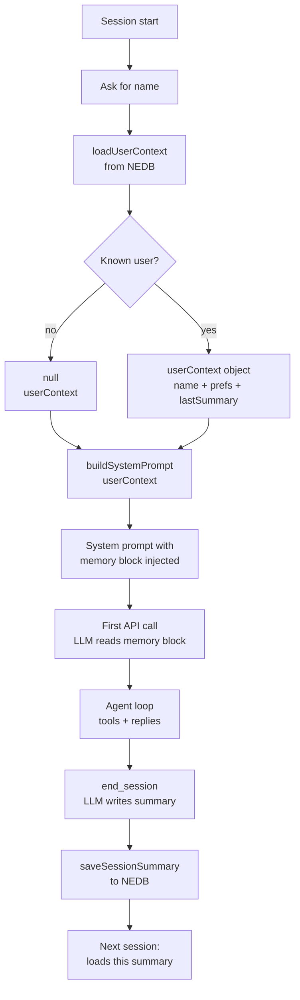
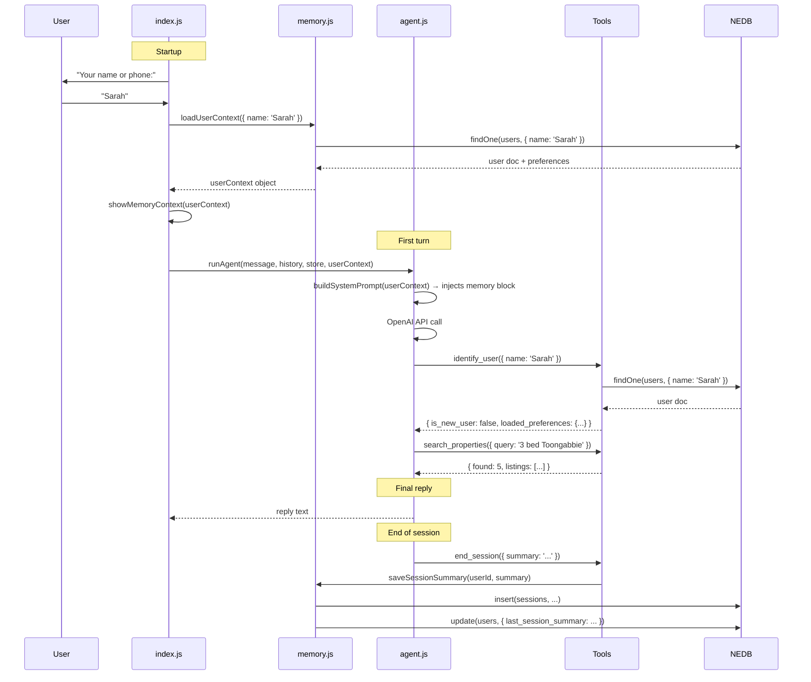

# Day 4 — LLM Memory: Persistent User Profiles

In Day 3 we built an agent that could search properties, capture leads, and analyse sentiment. It was autonomous — but amnesiac. Every session started from zero.

This session teaches you how LLMs get memory — and builds a version of the agent that remembers who you are.

---

## The Forgetting Problem

When you call the OpenAI API, **nothing persists**. The model does not remember your previous API call. Each request is stateless — the LLM reads only what you pass in the `messages` array, generates a response, and forgets everything.

This is not a bug. Transformer models are stateless by design. Memory is entirely your responsibility.

---

## Three Memory Strategies

| Strategy | How it works | Limit | Best for |
|---|---|---|---|
| **Full history injection** | Keep every message; send them all next session | Token limits; expensive as context grows | Short transcripts |
| **Summarisation** | Compress old turns into a summary; inject that | Loses exact details | Long sessions |
| **Structured state** (Day 4) | Extract key facts → store in DB → inject at session start | Scales indefinitely | User profiles, preferences |

Day 4 uses structured state injection — the production-grade approach.

---

## How It Works



The LLM "remembers" because we loaded facts from NEDB and wrote them into the system prompt as text. Before the first token is generated, the LLM reads: "Returning user — Name: Sarah, Budget: $750k-$850k, Last session: inspected Dunmore St."

---

## Session 1 vs Session 2

### Session 1 (new user)

```
Your name or phone: [Enter]

  ── Memory ──────────────────────────────────────────────
  No user profile found. Starting fresh.
  Agent will ask for your name and start building your profile.

You: Hi, I'm looking for a house
Agent: Hi! I'd love to help you find the right property.
       Could I get your name to get started?
```

Behind the scenes, `buildSystemPrompt(null)` produces:

```
NEW USER: You have not met this person before.
Ask for their name early in the conversation...
```

### Session 2 (returning user)

```
Your name or phone: Sarah

  ── Memory: Returning User Loaded ───────────────────────
  Name:     Sarah
  Sessions: 1
  Beds:     3+
  Budget:   $750k-$850k
  Suburbs:  Toongabbie
  Last:     "Sarah is looking for a 3 bed house in Toongabbie..."

  → Agent will greet Sarah by name and open with relevant listings.

You: Hi
Agent: Welcome back, Sarah! Last time we were looking at 3 bed homes
       in Toongabbie around $750k-$850k. Let me pull up today's listings...
```

Behind the scenes, `buildSystemPrompt(userContext)` produces:

```
RETURNING USER:
Name: Sarah
Previous sessions: 1
Known preferences:
  Beds: 3+
  Budget: $750k-$850k
  Suburbs: Toongabbie
Last session summary: Sarah is looking for a 3 bed house in Toongabbie...
```

The warm greeting is just the LLM reading that text. No fine-tuning. No special model. Just structured data formatted as a string and placed at the top of the context.

---

## The Agent Loop



---

## New Tools

Day 4 adds three tools on top of Day 3's four.

**`identify_user`** — called early in every session. Finds or creates the user profile in NEDB. Sets internal state so `update_preferences` and `end_session` know which user to update. Returns whether this is a new or returning user plus their loaded preferences.

**`update_preferences`** — called whenever the user mentions beds, budget, suburbs, must-haves, or timeline. Persists to NEDB incrementally — the preferences build up naturally as the conversation progresses. Arrays are merged across calls, not replaced.

**`end_session`** — called before the agent says goodbye. The LLM writes a plain-text summary of the conversation: who the user is, what they want, and what was discussed. This summary appears as "Last session:" in the next session's system prompt.

---

## How to Run

### 1. Install

```bash
cd day-4
npm install
```

### 2. API key

```bash
cp .env.example .env
# add your OpenAI key inside .env
```

### 3. Build the knowledge base

```bash
npm run prepare-data -- --suburb toongabbie-nsw-2146
```

Or copy the embeddings from Day 3 to skip re-scraping:

```bash
cp -r ../day-3/data/embeddings ./data/
```

### 4. Start the agent

```bash
npm start
```

### 5. Try Session 1 → Session 2

**Session 1** — press Enter at the name prompt (or type a new name):
```
You: I'm looking for a 3 bed house in Toongabbie, budget around $800k
You: My name is Sarah — 0412 345 678
You: goodbye
```
Watch `identify_user` → `update_preferences` → `end_session` fire in sequence.

Restart and type your name at the prompt.

**Session 2** — type the same name:
```
Your name or phone: Sarah
```
See the memory block load. Watch the agent's first reply change.

---

## Commands

| Command | What it shows |
|---|---|
| `show leads` | All captured leads with sentiment scores |
| `show callbacks` | All callback requests |
| `show profile` | Current user's preferences and session history |
| `show memory` | The exact text injected into this session's system prompt |
| `quit` | Exit |

---

## What Gets Stored

**`data/users.db`** — one document per user:

```json
{
  "name": "Sarah",
  "phone": "0412 345 678",
  "preferences": {
    "beds": 3,
    "budget": "$750k-$850k",
    "preferred_suburbs": ["Toongabbie"],
    "must_haves": ["garage"],
    "timeline": "3 months"
  },
  "sessionCount": 2,
  "last_session_summary": "Sarah inspected 3 listings on Dunmore St, strong interest in #45.",
  "createdAt": "2026-04-19T10:00:00.000Z"
}
```

**`data/sessions.db`** — one document per conversation:

```json
{
  "userId": "abc123",
  "summary": "Sarah looked at 3-bed houses in Toongabbie under $850k. Wants garage. Considering an inspection at 45 Dunmore St.",
  "createdAt": "2026-04-19T10:30:00.000Z"
}
```

---

## Key Concepts

### Session memory vs persistent memory

| | Session memory | Persistent memory |
|---|---|---|
| What it is | The `history` array in index.js | NEDB users.db and sessions.db |
| Scope | Current conversation only | Survives restarts |
| Mechanism | Passed to every `runAgent()` call | Loaded at startup; injected into system prompt |
| Example | "You asked about Dunmore St earlier" | "Last time you said you had a $800k budget" |

### Why call `identify_user` even for returning users?

The startup code (`index.js`) loads `userContext` from NEDB to feed `buildSystemPrompt`. But `update_preferences` and `end_session` operate on a module-level `currentUser` variable inside `tools.js` — that variable is only set when `identify_user` is called as a tool. The system prompt tells the LLM to call `identify_user` early, which sets up both the prompt memory (already done at startup) and the tool state (done when the LLM calls the tool).

### The LLM writes its own memory

`end_session` does not parse the conversation. It does not run NLP. The LLM fills in the `summary` parameter itself based on its reading of the conversation. Whatever the LLM decides is worth remembering becomes the next session's "Last session" note. No rules, no extraction pipeline — just the model summarising what it judged important.

---

> Session 1: a blank slate. Session 2: a familiar voice.
>
> The difference is one function call — `loadUserContext` — and one string — the memory block injected into `buildSystemPrompt`. Everything else is identical.

**Previous:** [Day 3 — AI Agents: Tool Use & Lead Capture](../day-3/README.md)
