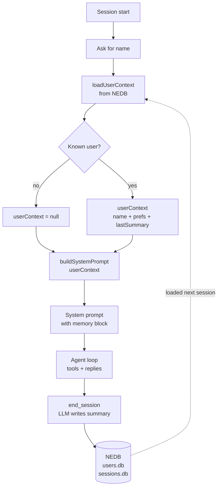
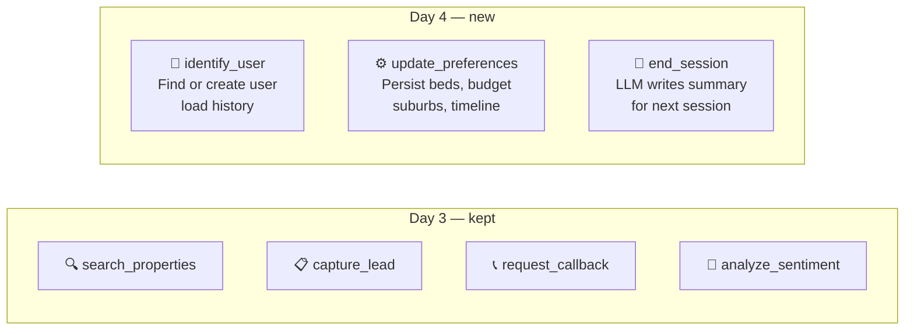

# Day 4 — LLM Memory: Persistent User Profiles

In Day 3 we built an agent that searched properties, captured leads, and scored conversations. It was autonomous — but amnesiac. Every session started from scratch.

This session gives the agent memory. It remembers who you are, what you want, and where you left off — across restarts.

---

## The Core Idea

LLMs have no memory. Every API call is stateless — the model reads only what you pass in `messages`, replies, and forgets everything.

To give an LLM memory, you:
1. Store facts in a database between sessions
2. Load those facts at startup
3. Format them as text and inject into the system prompt

The LLM "remembers" because it reads the injected text — not because it has persistent state.

---

## Session 1 vs Session 2

| | Session 1 | Session 2 |
|---|---|---|
| Name prompt | press Enter | type "Sarah" |
| Memory loaded | none | beds, budget, suburb, last summary |
| Agent's first reply | "Hi! What's your name?" | "Welcome back, Sarah! Want me to pull up 3-bed homes in Toongabbie?" |
| System prompt | `NEW USER: ask for their name` | `RETURNING USER: Name: Sarah, Budget: $800k...` |

---

## What You'll Learn

- **Structured state injection** — extract facts → store in NEDB → inject into system prompt
- **Dynamic system prompt** — `buildSystemPrompt(userContext)` changes every session
- **Three memory strategies** — full history, summarisation, structured state (and why structured state wins)
- **LLM writes its own memory** — `end_session` lets the model summarise what it judged important
- **Preference merging** — arrays append across calls, not replace

---

## How It Works



---

## New Tools

Day 4 adds three tools on top of Day 3's four:



| Tool | When called | What it stores |
|---|---|---|
| `identify_user` | Early — once agent has name | Sets `currentUser` in memory |
| `update_preferences` | User mentions beds, budget, suburb, timeline | Updates `preferences` on user doc |
| `end_session` | Before saying goodbye | New row in `sessions.db`, updates `last_session_summary` |

---

## How to Run

### 1. Install

```bash
cd day-4
npm install
```

### 2. API key

```bash
cp .env.example .env
# add your OpenAI key inside .env
```

### 3. Build the knowledge base

```bash
npm run prepare-data -- --suburb toongabbie-nsw-2146
```

Or copy from Day 3 to skip re-scraping:

```bash
cp -r ../day-3/data/embeddings ./data/
```

### 4. Start the agent

```bash
npm start
```

### 5. Try Session 1 → Session 2

**Session 1** — press Enter at the name prompt:
```
You: I'm looking for a 3 bed house in Toongabbie, budget around $800k
You: My name is Sarah — 0412 345 678
You: goodbye
```
Watch `identify_user` → `update_preferences` → `end_session` fire in sequence.

**Session 2** — restart and type the same name:
```
Your name or phone: Sarah
```
The memory block loads. The agent greets by name and searches without being asked.

**Commands:**

| Command | What it shows |
|---|---|
| `show leads` | All captured leads with sentiment scores |
| `show callbacks` | All callback requests |
| `show profile` | Current user's preferences and session history |
| `show memory` | The exact text injected into this session's system prompt |
| `quit` | Exit |

---

## Key Concepts

### Three memory strategies

| Strategy | How it works | Limit |
|---|---|---|
| Full history injection | Send all past messages every session | Hits token limits fast |
| Summarisation | Compress old turns, inject summary | Loses exact details |
| **Structured state** (Day 4) | Extract facts → NEDB → inject at session start | Scales indefinitely |

### The injection mechanism

`SYSTEM_PROMPT` in Day 3 was a static string. In Day 4 it is a function:

```js
// Day 3
const SYSTEM_PROMPT = `You are a property agent...`;

// Day 4
function buildSystemPrompt(userContext) {
  const memoryBlock = userContext
    ? `RETURNING USER:\nName: ${userContext.name}\nBudget: ${userContext.preferences.budget}...`
    : `NEW USER: Ask for their name early.`;

  return `You are a property agent...\n\n${memoryBlock}`;
}
```

The function is called once per turn. The LLM reads the memory block as natural text — it does not know the data came from a database.

### The LLM writes its own memory

`end_session` does not parse the conversation. The LLM fills in the `summary` parameter itself — it decides what is worth remembering. That summary becomes `Last session:` next time.

### What gets stored

**`data/users.db`:**
```json
{
  "name": "Sarah",
  "phone": "0412 345 678",
  "preferences": {
    "beds": 3,
    "budget": "$750k-$850k",
    "preferred_suburbs": ["Toongabbie"],
    "timeline": "3 months"
  },
  "sessionCount": 2,
  "last_session_summary": "Sarah inspected 3 listings on Dunmore St, strong interest in #45.",
  "createdAt": "2026-04-19T10:00:00.000Z"
}
```

**`data/sessions.db`:**
```json
{
  "userId": "abc123",
  "summary": "Sarah looked at 3-bed houses in Toongabbie under $850k. Wants inspection at 45 Dunmore St.",
  "createdAt": "2026-04-19T10:30:00.000Z"
}
```

---

> The agent loop is identical to Day 3. The model is the same. The only difference is what's in the context window.
>
> Load facts from a database. Format them as text. Inject at session start. That is how LLMs get memory.

**Previous:** [Day 3 — AI Agents: Tool Use & Lead Capture](../day-3/README.md)
